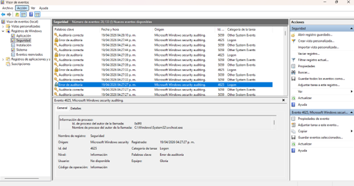
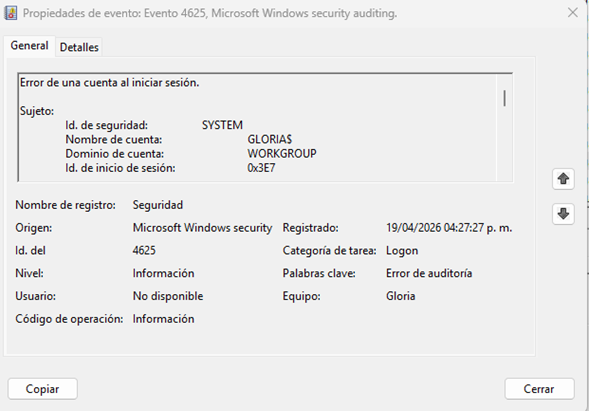

# 🔎 Security Log Analysis & Brute Force Detection Lab

## 📌 Overview
This project demonstrates how failed login attempts can be detected and analyzed using Windows Event Viewer.

The objective is to identify suspicious activity that could indicate a brute force attack and respond accordingly.

---

## 🛠️ Lab Environment
- Windows OS (Event Viewer - Spanish version)
- Local machine logs
- Security event logs

---

## 📊 Logs Collected

  
   
  <em>Figure 1: Multiple failed login attempts detected (Event ID 4625)</em>

  
   
  <em>Figure 2: Detailed view of failed login attempt (Event ID 4625)</em>

---

## 🔍 Analysis
Multiple failed login attempts were observed within a short period of time.

The repeated Event ID 4625 entries indicate unsuccessful login attempts, which could suggest a brute force attack.

---

## 🚨 Incident Identification
A potential brute force attack was identified based on:

- High number of failed login attempts  
- Repeated Event ID 4625  
- Same system targeted  

---

## 🛡️ Response Actions
If this were a real environment, the following actions would be taken:

- Investigate the source of login attempts  
- Block suspicious activity  
- Enable account lockout policies  
- Monitor further login attempts  

---

## 📚 Key Learnings
- Event logs are critical for detecting attacks  
- Failed login attempts can indicate brute force activity  
- Early detection helps prevent compromise  

---

## 🚀 Skills Demonstrated
- Log analysis  
- Threat detection  
- SOC mindset  
- Incident response basics  
